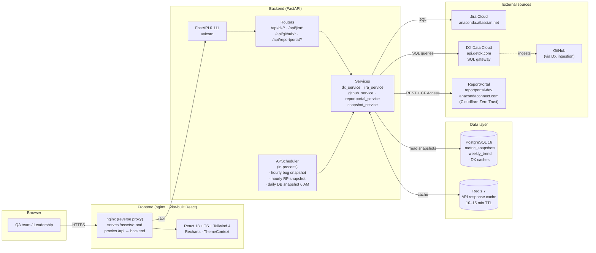
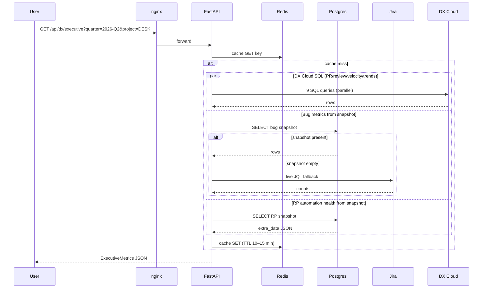
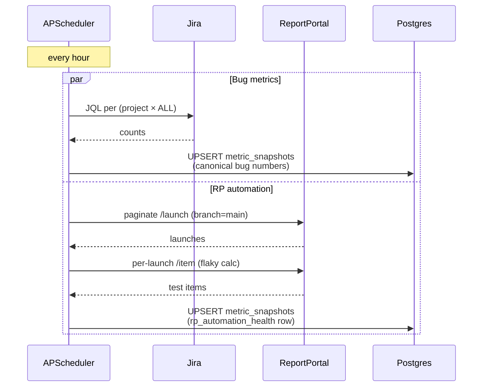

# QA Dashboard — Architecture

End-to-end view of the QA Metrics Dashboard: components, data sources, deployment topology, and the read/write paths the leadership and team views depend on.

## Component diagram



## Read path (leadership Dashboard)



## Snapshot path (background)



## Tech stack

### Backend (`backend/`)
| Layer | Choice | Version |
|---|---|---|
| Language | Python | 3.12 |
| Web framework | FastAPI | 0.111 |
| ASGI server | uvicorn | 0.29 |
| ORM | SQLAlchemy | 2.0 |
| Migrations | Alembic | 1.13 |
| Scheduler | APScheduler | 3.10 |
| HTTP client | httpx | 0.27 |
| DB driver | psycopg2-binary | 2.9 |
| Cache client | redis-py | 5.0 |
| Settings | pydantic-settings | 2.2 |

### Frontend (`frontend/`)
| Layer | Choice | Version |
|---|---|---|
| Language | TypeScript | 5.x |
| Framework | React | 18 |
| Build tool | Vite | 5.x |
| Styling | Tailwind CSS | 4.x |
| Charts | Recharts | latest |
| Static server | nginx (alpine) | 1.x |

### Data
| Component | Choice | Notes |
|---|---|---|
| Primary DB | PostgreSQL | 16-alpine |
| Cache / Queue | Redis | 7-alpine, AOF enabled |

## External integrations

| Source | Auth | Purpose |
|---|---|---|
| **Jira Cloud** (`anaconda.atlassian.net`) | Basic (email + API token) | Canonical source for bugs, story points, automation coverage |
| **DX Data Cloud** (`api.getdx.com`) | Bearer + team_id | Cross-system joins (Jira × GitHub × DX users), velocity & PR aggregates |
| **GitHub** | (via DX ingestion) | Not called directly — PR/review data flows through DX |
| **ReportPortal** (`reportportal-dev.anacondaconnect.com`) | Bearer + Cloudflare Zero Trust service token (CF-Access-Client-Id/Secret) | Test launches, pass/fail per project, flaky detection |

Source-of-truth split:

| Metric | Source | Why |
|---|---|---|
| QA-Reported Bugs, Resolution Rate, Bugs Fixed | **Jira API** (snapshotted) | DX Cloud silently misses ~38% of bugs (CLI / PREX / QA / MRKT projects not allowlisted in DX) |
| PRs / Merges / Avg Merge Time / Reviews | **DX Cloud SQL** | DX has the rich joins (PR ↔ team ↔ user) |
| Story Points / Cycle / Trends | **DX Cloud SQL** | Same |
| Pass Rate / Avg Duration / Flaky % | **ReportPortal** (snapshotted) | RP is the primary test-result store |
| DX scores (DEX, Quality, Ease of Delivery, factors) | **DX surveys** | Team-level only, not project-filterable |

## Caching & freshness

| Layer | TTL / cadence |
|---|---|
| Redis API response cache | 10–15 min for most; 30 min for Jira; 2 h for review stats |
| `MetricSnapshot.bug_metrics` | refreshed hourly via scheduler (warm-up 60 s after startup) |
| `MetricSnapshot.rp_automation_health` | refreshed hourly via scheduler (warm-up 90 s after startup) |
| Daily `WeeklyTrend` snapshot | once at 06:00 (cron) |

## Project filter behaviour

When a project is selected from the header dropdown:
- **Jira-sourced metrics** filter via `jira_projects.key` (DX SQL) or JQL `AND project = X`.
- **PR/review metrics** filter via `repos.name IN (...)` mapped from `PROJECT_CONFIG[project].repos`.
- **DX surveys / DORA** are team-level only — Project selector hides on DX view.
- **RP automation health** stays team-wide regardless of project selection (surfaced on Team view, not the leadership Dashboard, so it's an aggregate signal).

## Deployment

### Local (Docker Compose)
```
docker-compose.yml
├─ postgres   (5432, persistent volume postgres_data)
├─ redis      (6379, persistent volume redis_data)
├─ backend    (FastAPI, healthcheck: GET /health)
└─ frontend   (nginx, depends_on backend healthy)
```
Public ports: backend `8001:8000`, frontend `3001:3000`.

### Production
Same containers, orchestrated via `docker-compose.prod.yml` or Kubernetes (`k8s/` manifests, ArgoCD GitOps in line with rest of Anaconda infra).

### Secrets / env
| Var | Required | Source |
|---|---|---|
| `JIRA_USER_EMAIL`, `JIRA_API_TOKEN` | yes | Atlassian profile |
| `JIRA_BASE_URL` | yes | `https://anaconda.atlassian.net` |
| `GITHUB_TOKEN` | yes | personal access token (read-only repo) |
| `REPORTPORTAL_BASE_URL`, `REPORTPORTAL_API_TOKEN` | yes | RP profile / HCP Vault |
| `REPORTPORTAL_PROJECTS` | yes | comma-separated RP project slugs |
| `CF_ACCESS_CLIENT_ID`, `CF_ACCESS_CLIENT_SECRET` | yes (RP) | Cloudflare Zero Trust service token |
| `DX_API_TOKEN`, DX team id | yes | getdx.com |
| `REDIS_URL`, `DATABASE_URL` | container-set | docker-compose |

## Repository layout

```
backend/
├─ app/
│  ├─ main.py                 # FastAPI app, lifespan (scheduler + redis), aggregate /api/metrics/all
│  ├─ config.py               # Settings, SQUAD_CONFIG, PROJECT_CONFIG, ALL_QA_MEMBERS
│  ├─ database.py             # SQLAlchemy models: MetricSnapshot, WeeklyTrend, DX* caches
│  ├─ routers/                # /api/dx, /api/jira, /api/github, /api/reportportal, /api/members
│  ├─ services/
│  │  ├─ dx_service.py        # DX Cloud SQL queries, executive endpoint orchestrator
│  │  ├─ jira_service.py      # JQL queries, canonical bug metric, qa-fixed count
│  │  ├─ github_service.py    # PR stats / contributions / reviews via GitHub REST
│  │  ├─ reportportal_service.py  # Launches, flaky detection, branch=main filter
│  │  ├─ snapshot_service.py  # MetricSnapshot writers + readers
│  │  ├─ scheduler_service.py # APScheduler jobs
│  │  └─ cache_service.py     # Redis wrapper
│  └─ models/metrics.py       # Pydantic response shapes
└─ requirements.txt

frontend/
└─ src/
   ├─ App.tsx                 # Top-level router (Dashboard / Team / DX / Individual / QA Links)
   ├─ components/
   │  ├─ Sidebar.tsx          # Left nav, grouped by audience
   │  ├─ ExecutiveDashboard.tsx  # Leadership view, KPI tiles, sections
   │  ├─ TeamView.tsx         # Per-member breakdowns + Automation Health charts
   │  ├─ DXDashboard.tsx      # DX surveys, DORA, team scores
   │  ├─ IndividualView.tsx   # Single-member activity
   │  ├─ QALinksView.tsx      # Static resource hub
   │  ├─ ProjectSelector.tsx  # Dropdown
   │  └─ QuarterSelector.tsx  # Dropdown + getCurrentQuarter / getQuarterOptions
   ├─ context/ThemeContext.tsx
   └─ data/qaLinks.ts
```
